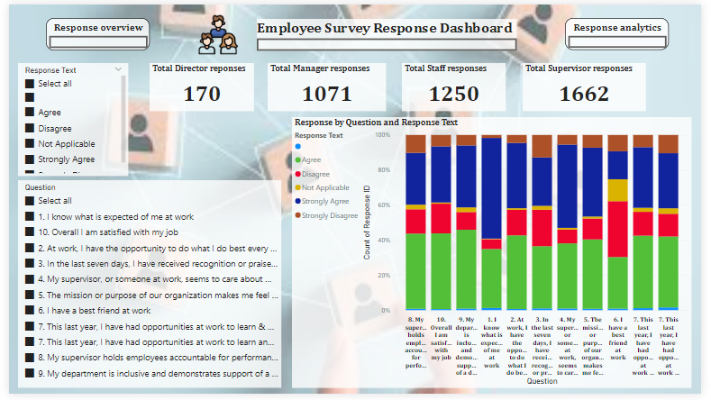
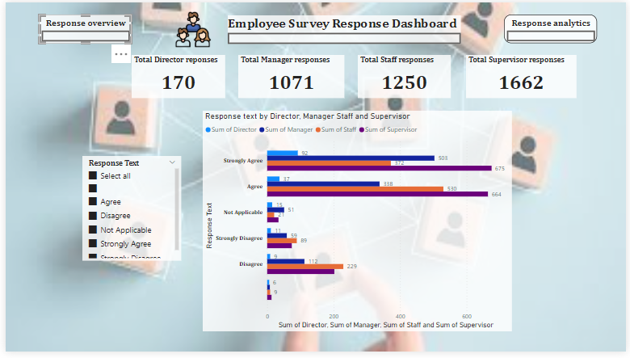

# Employee Satisfaction Survey Report by Ijeoma Nwosu

---
## Introduction
The aim of this project is to exhibit my problem solving, data cleaning, analyzing and visualizing skills with Employee survey response data using Power BI
The Employee Survey Responses are actual responses from an employee engagement survey conducted
by Pierce County WA and completed voluntarily by government employees. The dataset is a Single table
and contains 14,725 records. The total number of fields is 10.

**The Report consists of two pages imbedded in 2 buttons on the dashboard**
1.	Response overview
2.	Response analysis

**Problem Statement**
Question 1.
Which survey questions did respondents agree with or disagree with most?

Question 2.
Do you see any patterns or trends by department or role?

Question 3.
As an employer, what steps might you take to improve employee satisfaction based on the survey results?

**Data Sourcing**
The Dataset was provided by digitaleydrive
Link to Dataset  https://docs.google.com/spreadsheets/d/1nbhfp2ModgqDAPveYQG9CknRw2PYJQxbOTs3xSKOB 

**DAX Concepts*8
a.	Measures in DAX 

**Insights and Recommendations**

- Which survey questions did respondents agree with or disagree with most?
Agree with most -I know what is expected of me at work (54.5%)
Disagree with most - I have a best friend at work (31.9%)

---
- Do you see any patterns or trends by department or role?
The roles were mostly aligning with ‘agree’ and ‘strongly agree’ especially with questions that had to do with their job role and expertise.

- As an employer, what steps might you take to improve employee satisfaction based on the survey results?
  
**Based on this analysis, I propose the following recommendations**
1. Address existing gaps in certain areas such as fostering friendships at work, establishing career progression roadmaps, and recognizing employees' contributions. To initiate this process, the county could introduce a "buddy at work" program, pairing individuals from different departments to support each other.
2. Although specific job types are not detailed in this analysis, it's evident from industry trends that certain roles, such as those in IT operations and administrative tasks, may face challenges due to automation and outsourcing. To address dissatisfaction with career progression, it's crucial to identify employees' job types and transition them into roles with better growth opportunities. Providing re-skilling opportunities tailored to specific job types could be an effective starting point.
3. Educate managers about the significance of the "power of 2" and its impact on business outcomes, citing examples such as Roy Eisner and Frank G Wells. Emphasizing the importance of this concept can help managers recognize its relevance to their roles and discourage selecting "not applicable" as a response to related survey questions.

